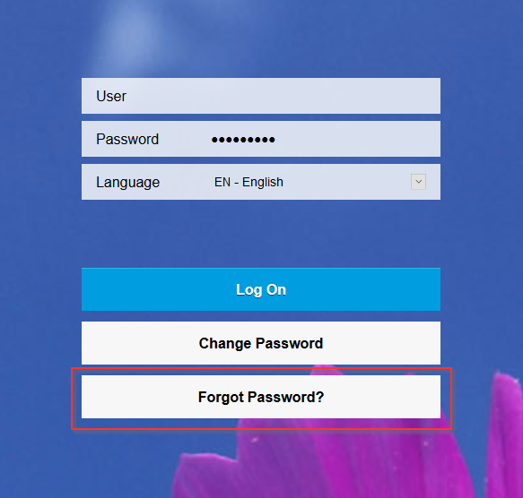
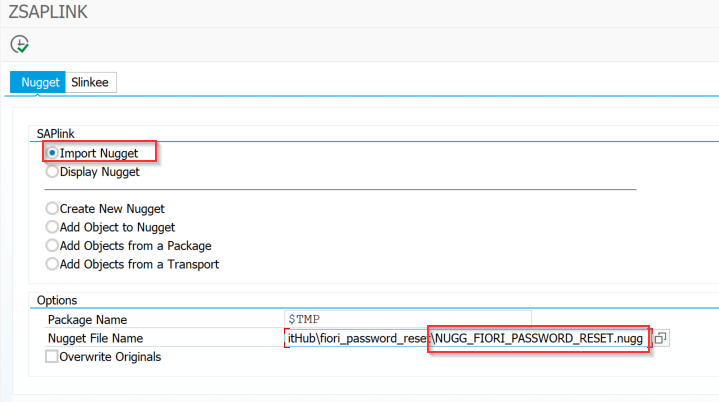
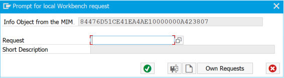
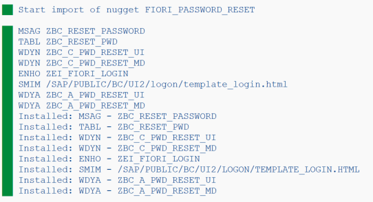
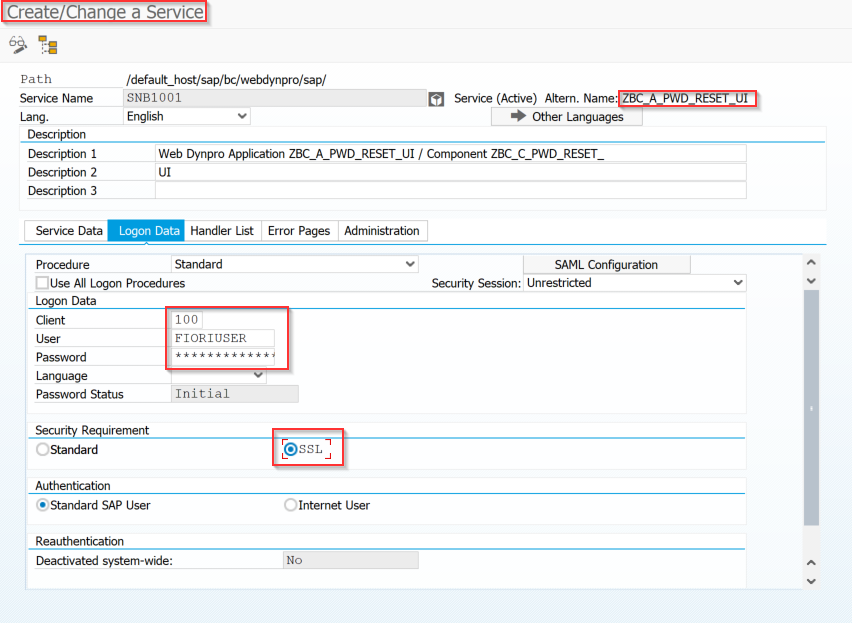

# Fiori Password Reset (fiori_password_reset)
Adds a button to the Fiori Login Screen to allow a user to change their password if they've forgotten it.
This version has been amended to use type "SYST_SUBRC" and also sysid "NPL"

## How to install

Download the latest release under the releases tab and unzip to a folder.  You must have SAPLink installed on your SAP system.  For information on SAPLink and how to install, visit the GitHub page https://github.com/sapmentors/SAPlink .

1. Run SAPLink and import the nugget NUGG_FIORI_PASSWORD_RESET.nugg. 

2. If you chose the $TMP package, you will get a prompt to create a workbench request for the MIME object template_login.html.  Proceed with creating it.

3. If all goes well, the status screen will show green on all lines.

4. Review all the installed objects and activate them.
5. Set links as needed.
  1. In WebDynpro ZBC_C_PWD_RESET_UI, View V_MAIN, Method ONACTIONSUBMIT, adjust code from lines 128 - 138 as required.
  2. On line 163 of the same method, change the email address.
  3. In Enhancement Implementation ZEI_FIORI_LOGIN, adjust code from lines 57 - 67 as required.  Use transaction code SE19 to get to the enhancement implementation.
6. Create a system user in transaction SU01.
7. Assign the user to the ICF services ZBC_A_PWD_RESET_UI and ZBC_A_PWD_RESET_MD. Use transaction code SICF.

8. Configure the SMTP server to use for sending emails to the user. User transaction code SCOT.  Use the wizard to create a new node, if needed.
